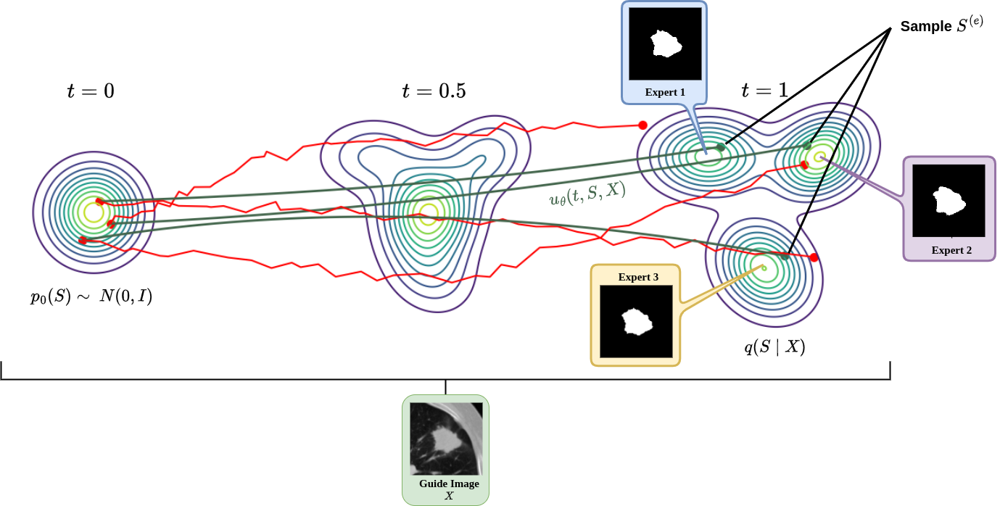

# Aleatoric Uncertainty Medical Image Segmentation Estimation via Flow Matching

Official implementation of the paper "Aleatoric Uncertainty Medical Image Segmentation Estimation via Flow Matching" (MICCAI UNSURE Workshop 2025).

## Requirements
- Python 3.6+
- PyTorch 1.7.1+
- CUDA 10.1+

## Installation

    git clone https://github.com/huynhspm/Data-Uncertainty
    cd Data-Uncertainty
    pip install -r requirements.txt

## Dataset
### LIDC-IDRI
We used the preprocessed **LIDC-IDRI** dataset available [here](https://github.com/stefanknegt/Probabilistic-Unet-Pytorch). To prepare the data:

1. Download and extract the dataset into the `data/lidc` directory.
2. Run the preprocessing scripts located in `dataset/preprocess/lidc`.

After preprocessing, the folder structure should look like this:

    lidc
    ├── Train.pickle
    ├── Val.pickle

### MMIS
We used the preprocessed **MMIS** dataset available [here](https://github.com/stefanknegt/Probabilistic-Unet-Pytorch). To prepare the data:

1. Download and extract the dataset into the `data/mmis` directory.
2. Run the preprocessing scripts located in `dataset/preprocess/mmis`.

After preprocessing, the folder structure should look like this:

    mmis
    ├── Train
    │   ├── Sample_0
    │   │   ├── image_0.npy
    │   │   ├── label_0.npy
    │   │   ├── image_1.npy
    │   │   ├── label_1.npy
    │   │   ├── ...
    │   ├── Sample_1
    │   │   ├── image_0.npy
    │   │   ├── label_0.npy
    │   │   ├── image_1.npy
    │   │   ├── label_1.npy
    │   │   ├── ...
    │   ├── ...
    ├── Val
    │   ├── Sample_0
    │   │   ├── image_0.npy
    │   │   ├── label_0.npy
    │   │   ├── image_1.npy
    │   │   ├── label_1.npy
    │   │   ├── ...
    │   ├── Sample_1
    │   │   ├── image_0.npy
    │   │   ├── label_0.npy
    │   │   ├── image_1.npy
    │   │   ├── label_1.npy
    │   │   ├── ...
    │   ├── ...

## Training

    python train.py \
    --dataset lidc \
    --data_path ${DATA_PATH} \
    --output_dir ${OUTPUT_DIR} \
    --batch_size=24 \
    --accum_iter=1 \
    --use_ema \
    --epochs=500 \
    --eval_frequency 100 \
    --class_drop_prob=0.5 \
    --cfg_scale=0.3 \
    --sym_func \
    --condition \
    --compute_dice_iou \
    --n_ensemble 1 \
    --mask_type random \
    --img_size 128

## Inference

    python3 eval_segmentation.py \
    --batch_size 64 \
    --n_ensemble 15 \
    --checkpoint ${CHECKPOINT_PATH} \
    --filename ${OUTPUT_NAME} \
    --cfg_scale 0.3

## References
[1] Lipman, Yaron, et al. "Flow matching guide and code." arXiv preprint arXiv:2412.06264 (2024).

[2] Ho, Jonathan, and Tim Salimans. "Classifier-free diffusion guidance." arXiv preprint arXiv:2207.12598 (2022).

## Citation
